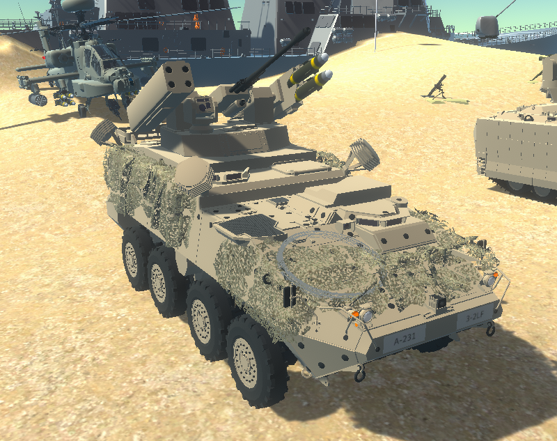
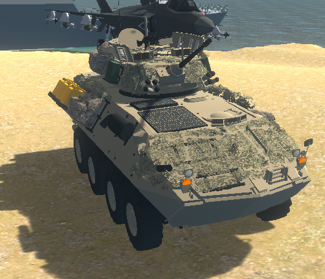
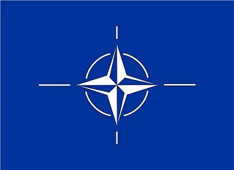

# 现代战争整体部署

# 1.美利坚合众国

## 1.1 LETMS 载具清单

### 1.1.1 M-SHORAD || JLTV

### 1.1.2 M2A4 || M2A3

### 1.1.3 LAV-25

### 1.1.4 M1A2 SEPV3 (TUSK1) COMMISSION || M1A2 SEPV2 (TUSK2)

## 1.2 Desert风格预设

### 1.2.1 M-SHORAD || JLTV

### 1.2.2 M2A4 || M2A3

### 1.2.3 M270 MLRS (US Desert) 1 || LAV-25

### 1.2.4 M1A2 SEPV3 (TUSK1) COMMISSION || M1A2 SEPV2 (TUSK2)

### 1.2.5 LAVAD DESERT || AAV7

### 1.2.7 V-22 Osprey VTOL GG 1

### 1.2.14 Patriot PAC-3 Desert gg

## 1.3 Snow风格预设

### 1.3.1 M-SHORAD(套Desert) || JLTV

### 1.3.2 M2A4(套Woodland) || M2A3(套Woodland)

### 1.3.3 M270 MLRS (Gray) 1 || LAV-25

### 1.3.4 M1A2 SEPV3 (TUSK1) COMMISSION(套Woodland)  || M1A2 SEPV2 (TUSK2)(套Woodland) 

### 1.3.5 LAVAD Woodland(套Woodland) || AAV7 woodland(套Woodland)

### 1.3.7 V-22 Osprey VTOL Dazzle

### 1.3.14 Patriot PAC-3 Woodland GG(套用Woodland)

## 1.4 Woodland风格预设

### 1.4.1 M-SHORAD || JLTV

### 1.4.2 M2A4 || M2A3

### 1.4.3 M270 MLRS (US Woodland) 2 || LAV-25

### 1.4.4 M1A2 SEPV3 (TUSK1) COMMISSION || M1A2 SEPV2 (TUSK2)

### 1.4.5 LAVAD Woodland || AAV7 woodland

### 1.4.7 V-22 Osprey VTOL Dazzle

### 1.4.14 Patriot PAC-3 Woodland GG

## 1.5 固定翼与直升机配置

### 1.5.1 lf_ah64

### 1.5.2 F-35A Lightning II  [Beast]

### 1.5.3 F-35B Lightning II  [Beast]

### 1.5.4 F-16C Viper

### 1.5.5(9) FA-18E Super Hornet

### 1.5.6(9) A-10C Thunderbolt II

### 1.5.7(9) B-2 Spirit [Carpet Bombing]

### 1.5.8(9) B-2 Spirit [Bunker Buster]

## 1.6 海军配置

### 1.6.1 Arleigh Burke-class Destroyer

### 1.6.2 我创死你

### 1.6.3 MG assault boatA

## 1.7 其余配置

### 1.7.1 士兵样式(180, 180, 1.3)

### 1.7.2 重机枪，迫击炮，陶氏导弹

#### 1.7.2.1 M2 4x ||M2

#### 1.7.2.2 M252

#### 1.7.2.3 BGM-71

### 1.7.3 无人机配置

| NULL     | Platform Drone | Fighter Drone | Attack Drone | Counter Drone Gun | Bomb Drone | Drone Remote |
| -------- | -------------- | ------------- | ------------ | ----------------- | ---------- | ------------ |
| 是否拥有 | true           | true          | true         | true              | true       | true         |
| 数量     | 2              | 3             | 4            | 不限              | 10         | 不限         |

### 1.7.4 核武器配置(12, 13, 14)

# 2.俄罗斯

## 2.1 LETMS 载具清单

## 2.7 其余配置

### 2.7.1 士兵样式(150, 150, 1.2)

### 2.7.3 无人机配置

| NULL     | Platform Drone | Fighter Drone | Attack Drone | Counter Drone Gun | Bomb Drone | Drone Remote |
| -------- | -------------- | ------------- | ------------ | ----------------- | ---------- | ------------ |
| 是否拥有 | false          | true          | true         | true              | true       | true         |
| 数量     | 0              | 1             | 4            | 不限              | 5          | 不限         |

### 2.7.4 核武器配置(12, 13, 14)

# 3.中华人民共和国

## 3.1 LETMS 载具清单

## 3.7 其余配置

### 3.7.1 士兵样式(150, 150, 1.2)

### 3.7.2 无人机配置

| NULL     | Platform Drone | Fighter Drone | Attack Drone | Counter Drone Gun | Bomb Drone | Drone Remote |
| -------- | -------------- | ------------- | ------------ | ----------------- | ---------- | ------------ |
| 是否拥有 | false          | true          | true         | true              | true       | true         |
| 数量     | 0              | 1             | 4            | 不限              | 5          | 不限         |

### 3.7.4 核武器配置(13, 14)

# 4.北大西洋公约组织

## 4.1 LETMS 载具清单

## 4.7 其余配置

### 4.7.3 无人机配置

| NULL     | Platform Drone | Fighter Drone | Attack Drone | Counter Drone Gun | Bomb Drone | Drone Remote |
| -------- | -------------- | ------------- | ------------ | ----------------- | ---------- | ------------ |
| 是否拥有 | false          | true          | true         | true              | true       | true         |
| 数量     | 0              | 1             | 4            | 不限              | 5          | 不限         |

### 4.7.4 核武器配置(13, 14)

